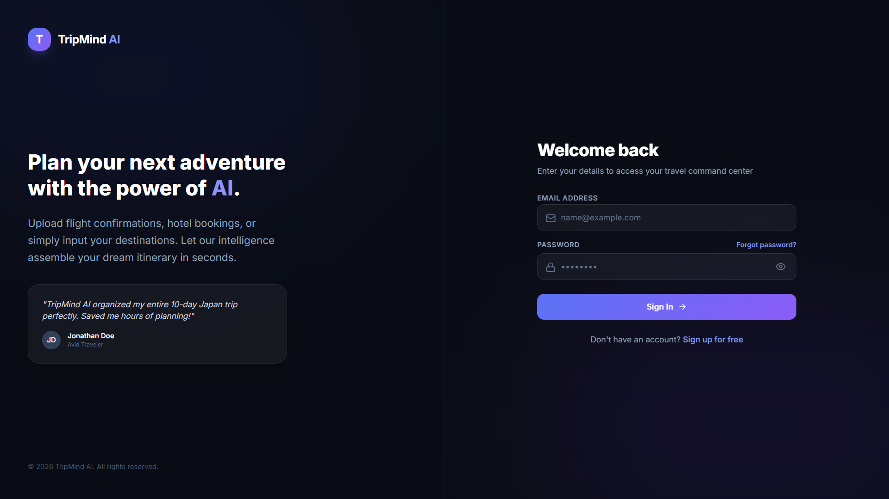
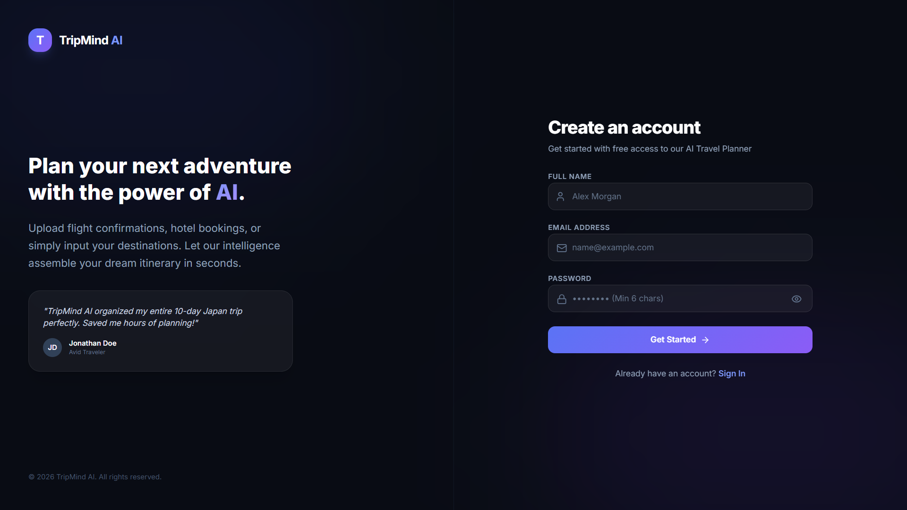
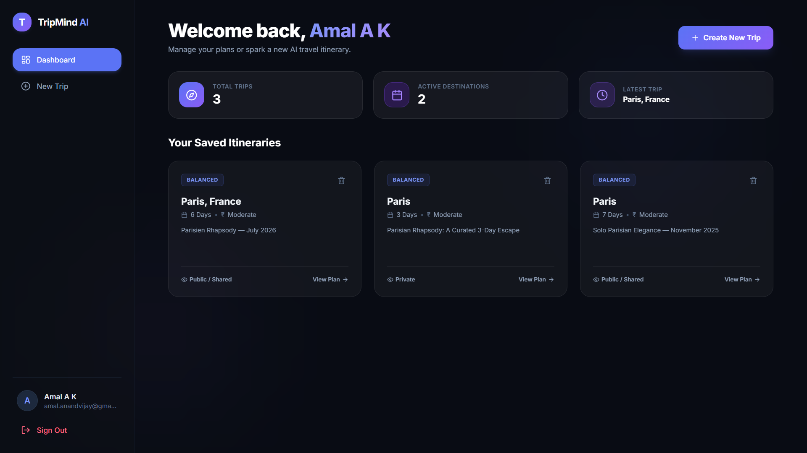
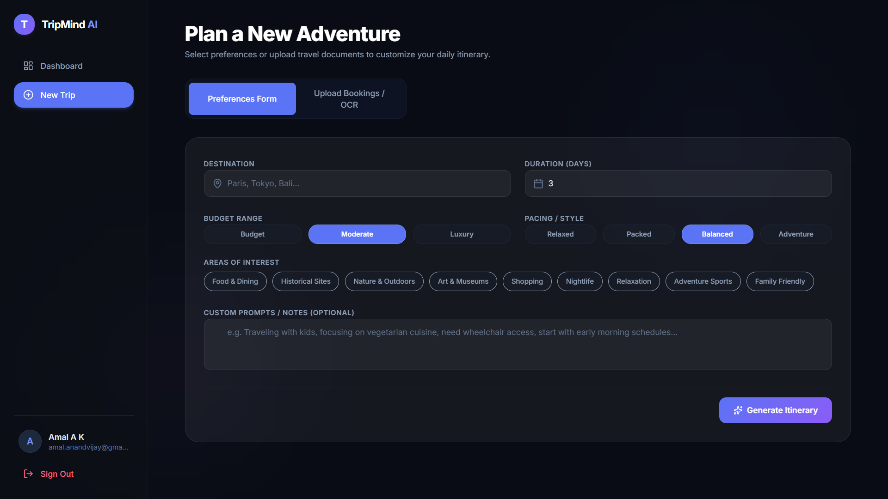
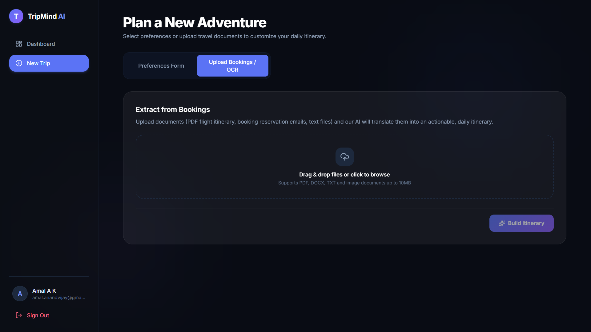
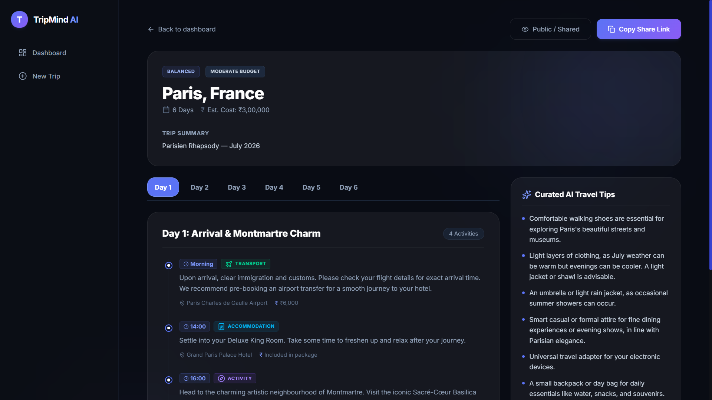
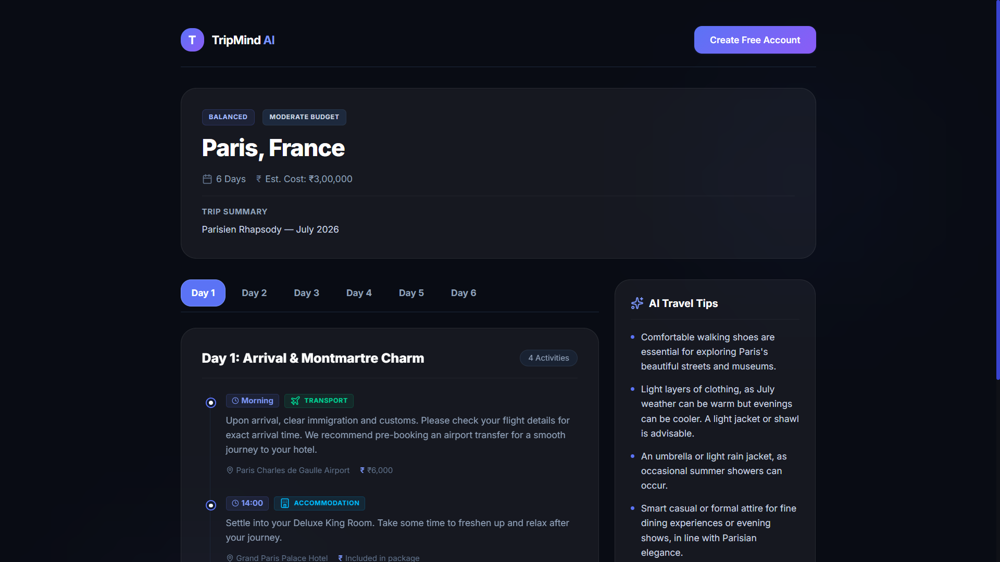

<div align="center">

# 🧠✈️ TripMind AI

### AI-Powered Travel Itinerary Generator

*Upload your bookings. Let AI plan the journey.*

[](https://react.dev/)
[](https://www.typescriptlang.org/)
[](https://nodejs.org/)
[](https://www.mongodb.com/atlas)
[](https://ai.google.dev/)
[](https://vercel.com/)
[](https://render.com/)
[](https://opensource.org/licenses/MIT)

</div>

---

## 📖 Project Overview

**TripMind AI** is a full-stack AI-powered travel planning application that transforms raw booking documents into rich, day-by-day travel itineraries in seconds.

Users can either **upload their travel documents** (flight tickets, hotel bookings, travel confirmations) or **fill out a simple preference form**, and TripMind AI will:

- Extract text from PDFs and scanned images using **OCR** and **PDF parsing**
- Use **Google Gemini** to intelligently parse booking details into structured data
- Generate a complete, personalized **day-by-day travel itinerary** with activities, timings, costs, and local tips
- Store itineraries in the cloud and allow users to **share them publicly** via a unique link

---

## 🌐 Live Demo

| Service | URL |
|---|---|
| 🌍 **Frontend (Vercel)** | [https://trip-mind-ai-eight.vercel.app/](https://trip-mind-ai-eight.vercel.app/) |
| ⚙️ **Backend API (Render)** | [https://tripmind-ai-server.onrender.com](https://tripmind-ai-server.onrender.com) |

> **Note:** The backend is hosted on Render's free tier. The server may take **up to 60 seconds** to wake up on the first request after a period of inactivity. The frontend will notify you while it starts up.

---

## ✨ Features

### 🔐 Authentication & Security
- JWT-based stateless authentication
- Secure password hashing with `bcryptjs`
- Protected routes on both frontend and backend
- Token stored in `localStorage` with automatic 401-redirect handling
- Password reset flow with expiring tokens

### 📁 Document Upload & Extraction
- Drag-and-drop file upload interface
- Support for **PDF**, **JPG**, and **PNG** files (up to 10 MB)
- **PDF text extraction** using `pdf-parse`
- **OCR (Optical Character Recognition)** for scanned images using `Tesseract.js`
- Automatic temp file cleanup after processing to prevent disk bloat

### 🤖 AI-Powered Intelligence (Google Gemini)
- Validates uploaded documents as legitimate travel booking documents
- Parses raw extracted text into structured travel data (flights, hotels, dates, PNRs)
- Generates personalized, day-by-day itineraries with:
  - Scheduled activities with timings
  - Location details
  - Estimated costs per activity
  - Practical travel tips
- Automatic **retry logic** with exponential backoff
- **Fallback model switching** (`gemini-2.5-flash` → `gemini-2.0-flash`) on failure

### 🗺️ Itinerary Management
- Generate itineraries from **uploaded booking documents** or a **manual preference form**
- View full itinerary details in an interactive day-by-day timeline
- Delete itineraries from your personal history
- Browse all previously generated itineraries in a personal dashboard

### 🔗 Shareable Itineraries
- Toggle any itinerary between **private** and **public**
- Each itinerary gets a unique, permanent share link (`/share/:shareId`)
- Public itineraries are accessible without login — perfect for sharing with travel companions

### 📱 User Experience
- Fully responsive UI for desktop and mobile
- Animated step-by-step loading screen during AI generation
- Skeleton loading placeholders during data fetching
- Toast notification system for actions and feedback
- Render cold-start warning if the backend server is waking up

---

## 🏗️ Architecture Overview

```
┌─────────────────────────────────────────────────────────────┐
│                      CLIENT (Vercel)                        │
│              React + TypeScript + Vite + Tailwind           │
└────────────────────────┬────────────────────────────────────┘
                         │ HTTPS / REST API
                         ▼
┌─────────────────────────────────────────────────────────────┐
│                    SERVER (Render)                          │
│               Node.js + Express.js                          │
│                                                             │
│  ┌─────────────┐  ┌─────────────┐   ┌──────────────────┐    │
│  │ Auth Routes │  │ Itinerary   │   │  Upload Routes   │    │
│  │  JWT/Bcrypt │  │ Routes      │   │  Multer + OCR    │    │
│  └─────────────┘  └─────┬───────┘   └───────┬──────────┘    │
│                         │                   │               │
│                   ┌─────▼───────────────────▼──────┐        │
│                   │       AI Service Layer         │        │ 
│                   │   Google Gemini API Integration│        │
│                   └────────────────────────────────┘        │
└──────────────────────────┬──────────────────────────────────┘
                           │ Mongoose ODM
                           ▼
┌─────────────────────────────────────────────────────────────┐
│                  DATABASE (MongoDB Atlas)                   │
│               Users Collection + Itineraries Collection     │
└─────────────────────────────────────────────────────────────┘
```

### 🖥️ Frontend
Built with **React 19 + TypeScript + Vite**, using `react-router-dom` v7 for client-side routing and **Tailwind CSS v4** for utility-first styling. Axios handles all API communication with request/response interceptors for auth token injection and 401 handling.

### ⚙️ Backend
**Node.js + Express.js (v5)** REST API in ESM module format. Uses a clean layered architecture: Routes → Controllers → Services → Models. Multer handles multipart file uploads; pdf-parse and Tesseract.js handle text extraction.

### 🗄️ Database
**MongoDB Atlas** cloud database with Mongoose ODM. Two collections: `users` and `itineraries`. The Itinerary schema stores the entire lifecycle from raw extracted text to the final AI-generated output.

### 🤖 AI Workflow
The Gemini integration is handled in a dedicated `ai.service.js` with:
1. **Validation prompt** — Is this actually a travel document?
2. **Extraction prompt** — Parse booking details into structured JSON
3. **Generation prompt** — Create a full day-by-day itinerary from the data
4. Retry logic with exponential backoff + model fallback

---

## 🔄 Application Workflow

```
User Action
    │
    ├── Upload Document (PDF / Image)
    │       │
    │       ├── PDF  → pdf-parse  ──┐
    │       └── Image → Tesseract OCR ─┤
    │                               │
    │                    Extracted Raw Text
    │                               │
    │                    ┌──────────▼──────────┐
    │                    │ Gemini: Validate    │
    │                    │ Travel Document?    │
    │                    └──────────┬──────────┘
    │                               │ ✅ Yes
    │                    ┌──────────▼────────── ┐
    │                    │ Gemini: Parse Booking│
    │                    │ → Structured JSON    │
    │                    └──────────┬────────── ┘
    │                               │
    │                    ┌──────────▼──────────┐
    │                    │ Gemini: Generate    │
    │                    │ Day-by-Day Itinerary│
    │                    └──────────┬──────────┘
    │                               │
    │                    ┌──────────▼──────────┐
    │                    │  MongoDB Atlas      │
    │                    │  Save Itinerary     │
    │                    └──────────┬──────────┘
    │                               │
    └──────── OR ──── Preferences Form
                                    │
                           Destination, Duration,
                           Budget, Style, Interests
                                    │
                           ┌────────▼────────┐
                           │ Gemini: Generate│
                           │ from Preferences│
                           └────────┬────────┘
                                    │
                         User Views / Shares Itinerary
```

---

## 📂 Folder Structure

```
TripMind-AI/
├── client/                          # React Frontend
│   ├── public/                      # Static assets
│   ├── src/
│   │   ├── api/
│   │   │   └── axiosInstance.ts     # Axios config with interceptors
│   │   ├── components/
│   │   │   ├── DeleteConfirmationModal.tsx
│   │   │   └── ProtectedRoute.tsx
│   │   ├── context/
│   │   │   └── AuthContext.tsx      # Global auth state (useReducer)
│   │   ├── hooks/
│   │   │   ├── useItineraries.ts
│   │   │   ├── useToast.ts
│   │   │   └── useRenderWakeUpWarning.ts
│   │   ├── layouts/
│   │   │   ├── AuthLayout.tsx
│   │   │   └── DashboardLayout.tsx
│   │   ├── pages/
│   │   │   ├── Login.tsx
│   │   │   ├── Register.tsx
│   │   │   ├── ForgotPassword.tsx
│   │   │   ├── ResetPassword.tsx
│   │   │   ├── Dashboard.tsx
│   │   │   ├── GenerateItinerary.tsx
│   │   │   ├── ItineraryDetail.tsx
│   │   │   └── ShareItinerary.tsx
│   │   ├── routes/
│   │   │   └── index.tsx            # React Router v7 routes
│   │   ├── services/
│   │   │   ├── authService.ts
│   │   │   └── itineraryService.ts
│   │   ├── types/                   # Shared TypeScript types
│   │   ├── utils/
│   │   │   └── currency.ts
│   │   ├── App.tsx
│   │   ├── main.tsx
│   │   └── index.css
│   ├── vercel.json                  # Vercel SPA routing + API proxy
│   ├── vite.config.ts
│   ├── tsconfig.app.json
│   └── package.json
│
├── server/                          # Node.js Backend
│   ├── src/
│   │   ├── config/
│   │   │   ├── db.js                # MongoDB connection
│   │   │   └── ai.js                # Gemini client initialization
│   │   ├── controllers/
│   │   │   ├── auth.controller.js
│   │   │   ├── itinerary.controller.js
│   │   │   └── upload.controller.js
│   │   ├── middlewares/
│   │   │   ├── auth.middleware.js   # JWT protect middleware
│   │   │   ├── error.middleware.js  # Centralized error handler
│   │   │   └── upload.middleware.js # Multer config
│   │   ├── models/
│   │   │   ├── User.js
│   │   │   └── Itinerary.js
│   │   ├── routes/
│   │   │   ├── auth.routes.js
│   │   │   ├── itinerary.routes.js
│   │   │   └── upload.routes.js
│   │   ├── services/
│   │   │   ├── ai.service.js        # Gemini integration + retry logic
│   │   │   ├── extraction.service.js
│   │   │   ├── pdf.service.js       # pdf-parse integration
│   │   │   └── ocr.service.js       # Tesseract.js integration
│   │   ├── utils/
│   │   │   ├── generateToken.js
│   │   │   └── promptTemplates.js   # All Gemini prompt builders
│   │   ├── app.js                   # Express app (middleware + routes)
│   │   └── server.js                # Entry point (DB connect + listen)
│   ├── uploads/                     # Temporary upload storage (auto-cleaned)
│   ├── .env
│   └── package.json
│
├── .gitignore
└── README.md
```

---

## 📡 API Endpoints

### Authentication — `/api/auth`

| Method | Endpoint | Auth Required | Description |
|--------|----------|:---:|-------------|
| `POST` | `/api/auth/register` | ❌ | Create a new user account |
| `POST` | `/api/auth/login` | ❌ | Login and receive JWT token |
| `GET` | `/api/auth/me` | ✅ | Get the current authenticated user |
| `POST` | `/api/auth/forgot-password` | ❌ | Request a password reset token |
| `POST` | `/api/auth/reset-password/:token` | ❌ | Reset password using token |

### Itineraries — `/api/itineraries`

| Method | Endpoint | Auth Required | Description |
|--------|----------|:---:|-------------|
| `GET` | `/api/itineraries` | ✅ | Get all itineraries for the logged-in user |
| `GET` | `/api/itineraries/:id` | ✅ | Get a single itinerary by ID |
| `POST` | `/api/itineraries/generate` | ✅ | Generate itinerary from preferences form |
| `POST` | `/api/itineraries/generate-from-file` | ✅ | Generate itinerary from uploaded document |
| `DELETE` | `/api/itineraries/:id` | ✅ | Delete an itinerary |
| `PATCH` | `/api/itineraries/:id/toggle-public` | ✅ | Toggle public/private sharing |

### Public Sharing — `/api/share`

| Method | Endpoint | Auth Required | Description |
|--------|----------|:---:|-------------|
| `GET` | `/api/share/:shareId` | ❌ | View a public itinerary by share token |

### System

| Method | Endpoint | Auth Required | Description |
|--------|----------|:---:|-------------|
| `GET` | `/api/health` | ❌ | Server health check (status, timestamp, environment) |

---

## 🔑 Environment Variables

### Backend — `server/.env`

```env
PORT=5000
MONGO_URI=mongodb+srv://<user>:<password>@cluster0.xxxxx.mongodb.net/tripmind-ai
JWT_SECRET=your_jwt_secret_key_here
GEMINI_API_KEY=your_google_gemini_api_key
CLIENT_URL=https://your-app-name.vercel.app
NODE_ENV=production
```

### Frontend — `client/.env` *(Optional — not currently required)*

```env
# Reserved for future use if direct API URL is needed
VITE_API_URL=https://tripmind-ai-server.onrender.com
```

> **Note:** The frontend currently uses Vercel's rewrite proxy (`vercel.json`) to forward `/api/*` requests to the Render backend. No environment variable is needed unless you switch to direct absolute API calls.

---

## 🛠️ Local Development Setup

### Prerequisites

- **Node.js** v18 or higher
- **npm** v9 or higher
- A **MongoDB Atlas** cluster URI
- A **Google Gemini API Key** — [Get one here](https://ai.google.dev/)

### 1. Clone the Repository

```bash
git clone https://github.com/Amal-A-K/TripMind_AI.git
cd TripMind_AI
```

### 2. Setup the Backend

```bash
cd server
npm install
```

Create your environment file:

```bash
cp .env.example .env
# Then fill in the values in .env
```

Start the development server:

```bash
npm run dev
# Server runs at: http://localhost:5000
```

### 3. Setup the Frontend

Open a new terminal:

```bash
cd client
npm install
npm run dev
# Frontend runs at: http://localhost:5173
```

The Vite dev server is pre-configured to proxy `/api/*` requests to `http://localhost:5000`, so no extra config is needed.

---

## 🚀 Deployment Instructions

### ☁️ Backend Deployment (Render)

1. Go to [render.com](https://render.com/) and sign in.
2. Click **New → Web Service** and connect your GitHub repository.
3. Configure the service:
   - **Root Directory:** `server`
   - **Environment:** `Node`
   - **Build Command:** `npm install`
   - **Start Command:** `npm start`
4. Under **Environment Variables**, add all variables from the [Backend environment section](#backend--serverenv) above.
5. **Important:** In MongoDB Atlas, go to **Network Access** and add `0.0.0.0/0` to allow connections from Render's dynamic IPs.
6. Click **Create Web Service** and copy your Render URL.

### 🌍 Frontend Deployment (Vercel)

1. Go to [vercel.com](https://vercel.com/) and sign in.
2. Click **Add New → Project** and import your GitHub repository.
3. Configure the project:
   - **Root Directory:** `client`
   - **Framework Preset:** `Vite`
   - **Build Command:** `npm run build`
   - **Output Directory:** `dist`
4. Update `client/vercel.json` with your final Render service URL:
   ```json
   "destination": "https://your-render-service.onrender.com/api/:path*"
   ```
5. Also update the `CLIENT_URL` environment variable on Render to point to your Vercel domain.
6. Click **Deploy**.

---

## 📸 Screenshots

| Page | Preview |
|------|---------|
| **Login** | ** |
| **Register** | ** |
| **Dashboard** | ** |
| **Generate Itinerary (Form)** | ** |
| **Upload Travel Document** | ** |
| **Itinerary Detail View** | ** |
| **Shared Itinerary (Public)** | ** |

---

## 🔮 Future Improvements

| Feature | Description |
|---------|-------------|
| ☁️ **AWS S3 / Cloudinary Storage** | Store uploaded documents persistently rather than using ephemeral disk storage |
| 🌍 **Multi-language Support** | Generate itineraries in the user's preferred language |
| 📅 **Calendar Export** | Export generated itineraries to Google Calendar or `.ics` format |
| 📧 **Email Sharing** | Send itineraries directly to email via SendGrid or Resend |
| 👥 **Trip Collaboration** | Invite co-travelers to view and edit shared itineraries in real time |
| 🗺️ **Interactive Map View** | Visualize activity locations on an embedded map (Google Maps / Mapbox) |
| 🔔 **Push Notifications** | Remind users of upcoming trip dates |
| 📊 **Budget Tracker** | Real-time spending tracker tied to itinerary estimated costs |

---

## 👨‍💻 Author

**Amal A K**

[](https://github.com/Amal-A-K)

---

## 📄 License

This project is licensed under the **MIT License**.

```
MIT License

Copyright (c) 2026 Amal A K

Permission is hereby granted, free of charge, to any person obtaining a copy
of this software and associated documentation files (the "Software"), to deal
in the Software without restriction, including without limitation the rights
to use, copy, modify, merge, publish, distribute, sublicense, and/or sell
copies of the Software, and to permit persons to whom the Software is
furnished to do so, subject to the following conditions:

The above copyright notice and this permission notice shall be included in all
copies or substantial portions of the Software.

THE SOFTWARE IS PROVIDED "AS IS", WITHOUT WARRANTY OF ANY KIND, EXPRESS OR
IMPLIED, INCLUDING BUT NOT LIMITED TO THE WARRANTIES OF MERCHANTABILITY,
FITNESS FOR A PARTICULAR PURPOSE AND NONINFRINGEMENT. IN NO EVENT SHALL THE
AUTHORS OR COPYRIGHT HOLDERS BE LIABLE FOR ANY CLAIM, DAMAGES OR OTHER
LIABILITY, WHETHER IN AN ACTION OF CONTRACT, TORT OR OTHERWISE, ARISING FROM,
OUT OF OR IN CONNECTION WITH THE SOFTWARE OR THE USE OR OTHER DEALINGS IN THE
SOFTWARE.
```

---

<div align="center">

**Built with ❤️ by Amal A K**

*If you found this project useful, consider giving it a ⭐ on GitHub!*

</div>
